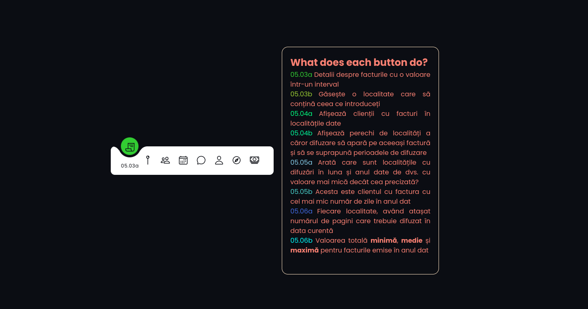

# SQL Database Project

## Description and Purpose
The project interacts with a Database (MariaDB) by using `SQL`. The database is 
managed with the help of [PhpMyAdmin](https://www.phpmyadmin.net/). 

`HTML` and `PHP` are used for creating the client-side interface.  
  

## Functional requests
	Implement a DB that has four tables:
	- Client
	- Receipt
	- City
	- Broadcast
	Implement a number of CRUD operations and also implement triggers.
 	
More details can be found in [this document](./Colocviu_partial/Subiect_partial_laborator_05.pdf) (romanian only).

	Populate the database and implement a client-side interface to prove
	the working state of your database communication.
 
More details can be found in [this other document](./Colocviu_final/Tema_pentru_colocviul_de_laborator.pdf) (romanian only).

## Modules
The project contains two folders (packages):  
- `Colocviu partial` -> which has the SQL queries required by the PDF file with the tasks in the same file;  
- `Colocviu final`
	- `menu.html` is the starting point
	- for each task (5.03x to 5.06x, x being A, then B) a .php file was created to keep the solutions (required by the PDF file with the tasks in the same folder) organised.
